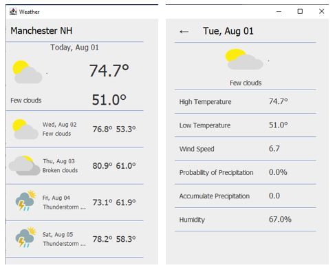
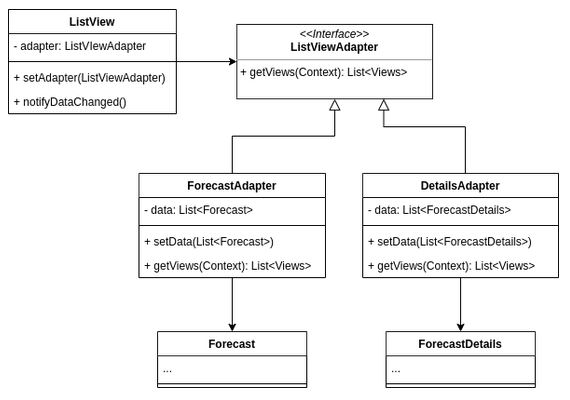

# Lab5: Weather Forecast Part 1

- The left view (main view) shows the 5-day forecast.
- The righ view shows the detailed forecase on the day clicked on the main view.

## Objectives

- Learn how to use and implement Adapter Design Pattern.
- Review the Open-Closed Principle.
- Learn how to use an internet weather forecast service.

## Work

1. Review [Weatherbit's 16-Dat Weather Forecast](https://www.weatherbit.io/api/weather-forecast-16-day), which describes the weather forecast data used in this application.
2. Open `WeatherAPI.java` and check:
- How is the endpoint URL built?
- When is the network request is executed?
- What data structure does your request return?
- How is this data structure converted to the `Forecast` object?
3. In order to receive the weather forecast data from Weatherbit, you need the API key. You can generate your own key by creating an account at [Weatherbit.io](https://www.weatherbit.io/) for free. 
4. :computer: **Put your key in the API key string.**
5. Review `Forecast.java` and `ForecastDetail.java` to find how the weather forecast items are handled.
6. `ListViewAdapter` is defined as an interface, which is implemented by `ForecastAdapter` and `DetailsAdapter` classes. Check how the adapter is implemented by the two classes.

7. Check how the `ForecastAdapter` and `DetailsAdapter` classes implement the `getViews()` method.
8. :computer: **Implement the `updateData()` method in the `ListView` class, which calls the `update()` method of each view in the list of views returned by the current adapter. Note that the `View` class is defined in `View.java`.**

---
End of Lab5

